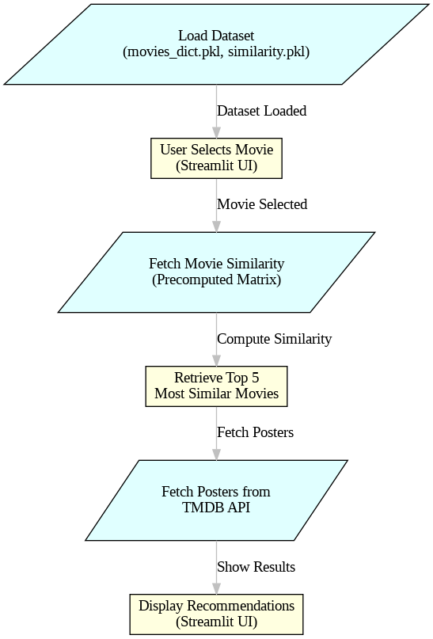
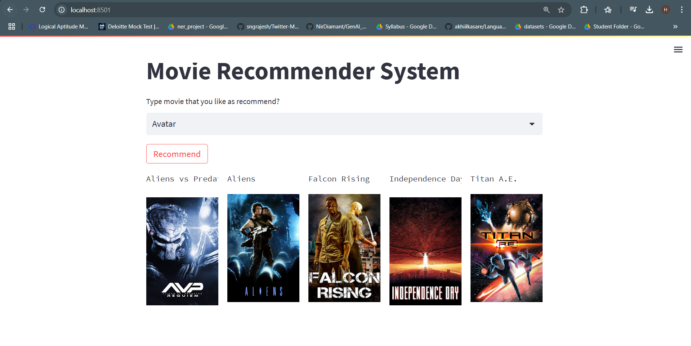

<h2>
Movie Recommender System
</h2>

<h3><strong>Datsets : </strong>https://www.kaggle.com/datasets/tmdb/tmdb-movie-metadata</h3>

          

<h2>Project Workflow</h2>

<h3>1. Load Movie Dataset (Pickle Files)</h3>
<ul> <li>The <strong>movies_dict.pkl</strong> file contains a dictionary of movies.</li> <li>The <strong>similarity.pkl</strong> file is a precomputed matrix with similarity scores.</li> <li>The data is converted into a Pandas DataFrame for easy processing.</li> </ul>
<h3>2️. Movie Selection (Streamlit UI)</h3>
<ul> <li>The <strong>Streamlit select box</strong> provides an interactive dropdown menu.</li> <li>The selected movie is used for generating recommendations.</li> </ul>
<h3>3. Fetch Movie Poster (TMDB API)</h3>
<ul> <li>Uses the <strong>TMDB API</strong> to fetch movie posters.</li> <li>Returns the <strong>image URL</strong> based on the movie ID.</li> </ul>
<h3>4. Movie Recommendation (Similarity Matrix & Cosine Similarity)</h3>
<ul> <li>Finds the **selected movie's index** in the dataset.</li> <li>Retrieves **precomputed similarity scores** from the matrix.</li> <li>Sorts the **top 5 most similar movies** and fetches their posters.</li> </ul>
<h3>5. Display Recommendations in Streamlit UI</h3>
<ul> <li>The **"Recommend"** button triggers the recommendation system.</li> <li>Displays movie names and posters using a **5-column layout** in Streamlit.</li> </ul>

div align="center">
  <h2>My Application UI</h2>
  
    

